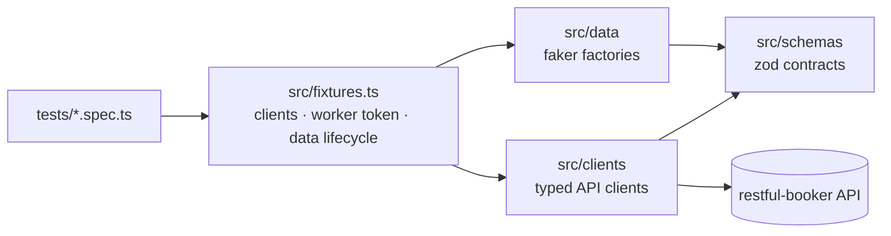

# restful-booker API Test Framework — Playwright + TypeScript

[](https://github.com/qasimmahmood95/playwright-api-automation-ts/actions/workflows/ci.yml)
[](https://github.com/qasimmahmood95/playwright-api-automation-ts/actions/workflows/nightly.yml)
[](https://qasimmahmood95.github.io/playwright-api-automation-ts/)
[](LICENSE)

A production-grade API test framework for the public
[restful-booker](https://restful-booker.herokuapp.com/apidoc/index.html) API.
What it demonstrates: **typed API clients composed through Playwright
fixtures**, **zod contract validation on every response**, **faker data
factories with reproducible seeds**, and a **staged CI pipeline** that
publishes its report and monitors the live API nightly.

## Quick start

```bash
git clone https://github.com/qasimmahmood95/playwright-api-automation-ts.git
cd playwright-api-automation-ts
npm ci
npm test
```

Zero configuration required — and **no browser install**: the suite drives
Playwright's `APIRequestContext` only. All environment variables are optional
(see [`.env.example`](.env.example)); the defaults target the public demo API
with its publicly documented demo credentials.

## Architecture



- **Clients** (`src/clients/`) are thin typed wrappers over the injected
  `request` fixture — happy-path methods assert status and parse the full body
  through zod schemas; `*Raw` variants let negative tests probe error
  semantics.
- **Fixtures** (`src/fixtures.ts`) compose them: a worker-scoped auth token
  (one `/auth` call per worker), and a booking factory that deletes everything
  it created in teardown — even when the test fails.
- **Schemas** (`src/schemas/`) are the single source of truth: `z.infer`
  derives the static types used by clients, factories, and tests.
- **Data** (`src/data/`) is faker-built and unique per run; every test is
  annotated with the seed so any failure replays with `FAKER_SEED=<seed>`.

## Scripts

| Script                    | What it does                                        |
| ------------------------- | --------------------------------------------------- |
| `npm test`                | Full suite                                          |
| `npm run test:smoke`      | `@smoke` tests — fast signal                        |
| `npm run test:regression` | `@regression` tests (quarantine excluded)           |
| `npm run test:negative`   | `@negative` tests                                   |
| `npm run test:ci`         | What CI runs — everything except `@quarantine`      |
| `npm run check`           | Typecheck + lint + format check (same gate CI runs) |
| `npm run report`          | Open the local HTML report                          |

## Known API defects this suite documents

restful-booker is intentionally buggy; asserting its real behavior — with the
deviation annotated — is part of the point. A taste (full register in the
[test strategy](docs/TEST-STRATEGY.md)):

| Behavior                        | Actual             | Conventional |
| ------------------------------- | ------------------ | ------------ |
| `DELETE /booking/{id}` succeeds | `201 Created`      | `200`/`204`  |
| Validation failure on create    | `500`              | `400`        |
| Failed auth (`POST /auth`)      | `200` + `{reason}` | `401`        |
| Mutation on a nonexistent id    | `405`              | `404`        |

Every such assertion carries an inline comment and a report annotation
(`api-quirk`), so the odd expected status reads as documented reality, not a
mistake.

## CI/CD

Quality gates (lint, typecheck, format — the same `npm run check` you run
locally) gate the test job; superseded PR runs are cancelled; the latest
main-branch report (pass **or** fail) publishes to
[GitHub Pages](https://qasimmahmood95.github.io/playwright-api-automation-ts/).
A separate [nightly workflow](.github/workflows/nightly.yml) runs the suite
against the live API as a canary and files/updates a `nightly-failure` issue
on failure — the badge doubles as an API health monitor. Dependabot keeps npm
packages and actions current.

## Design decisions

The reasoning is the point — each decision is a short ADR:

- [ADR-0001 — Fixtures + typed clients instead of Page Objects](docs/adr/0001-fixtures-over-page-objects.md)
- [ADR-0002 — zod for response contract validation](docs/adr/0002-zod-schema-validation.md)
- [ADR-0003 — faker factories over static JSON test data](docs/adr/0003-data-factories-over-static-json.md)

The [test strategy](docs/TEST-STRATEGY.md) covers the full coverage matrix,
the flakiness policy for a shared public API, the quarantine workflow, and —
deliberately — what this suite does **not** include, and why.

## Roadmap

- Hermetic mode: docker-compose running restful-booker locally
  (`BASE_URL=http://localhost:3001` — the env plumbing already supports it)
- Rehab the quarantined checkin-filter test after verifying the reported
  upstream off-by-one against the live API
- Pin GitHub Actions to commit SHAs (dependabot already tracks them by tag)
